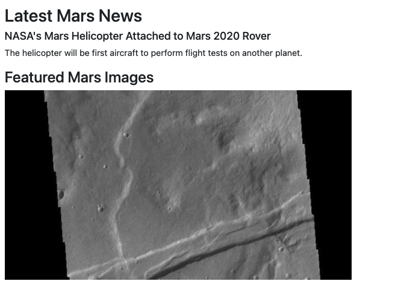

### web-scraping-challenge


### NASA Mars News

* Scrape the [Mars News Site](https://redplanetscience.com/) and collect the latest News Title and Paragraph Text. Assign the text to variables that you can reference later.

```python
# Example:
news_title = "NASA's Next Mars Mission to Investigate Interior of Red Planet"

news_p = "Preparation of NASA's next spacecraft to Mars, InSight, has ramped up this summer, on course for launch next May from Vandenberg Air Force Base in central California -- the first interplanetary launch in history from America's West Coast."
```



### JPL Mars Space Images - Featured Image

* Visit the url for the Featured Space Image site [here](https://spaceimages-mars.com).

* Use splinter to navigate the site and find the image url for the current Featured Mars Image and assign the url string to a variable called `featured_image_url`.

* Make sure to find the image url to the full size `.jpg` image.

* Make sure to save a complete url string for this image.

```python
# Example:
featured_image_url = 'https://spaceimages-mars.com/image/featured/mars2.jpg'
```

### Mars Facts

* Visit the Mars Facts webpage [here](https://galaxyfacts-mars.com) and use Pandas to scrape the table containing facts about the planet including Diameter, Mass, etc.

* Use Pandas to convert the data to a HTML table string.


### Mars Hemispheres

* Visit the astrogeology site [here](https://marshemispheres.com/) to obtain high resolution images for each of Mar's hemispheres.

* You will need to click each of the links to the hemispheres in order to find the image url to the full resolution image.

* Save both the image url string for the full resolution hemisphere image, and the Hemisphere title containing the hemisphere name. Use a Python dictionary to store the data using the keys `img_url` and `title`.

* Append the dictionary with the image url string and the hemisphere title to a list. This list will contain one dictionary for each hemisphere.

```python
# Example:
hemisphere_image_urls = [
    {"title": "Valles Marineris Hemisphere", "img_url": "..."},
    {"title": "Cerberus Hemisphere", "img_url": "..."},
    {"title": "Schiaparelli Hemisphere", "img_url": "..."},
    {"title": "Syrtis Major Hemisphere", "img_url": "..."},
]
```

- - -


